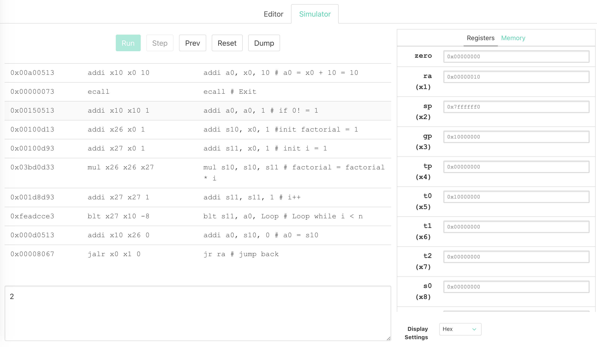
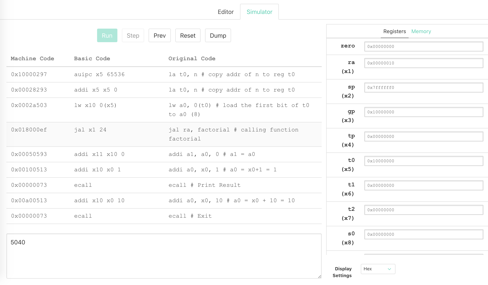
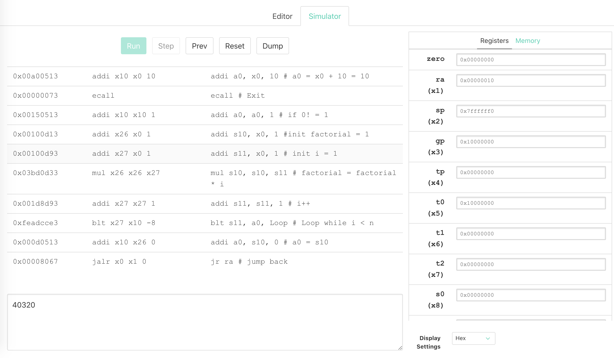
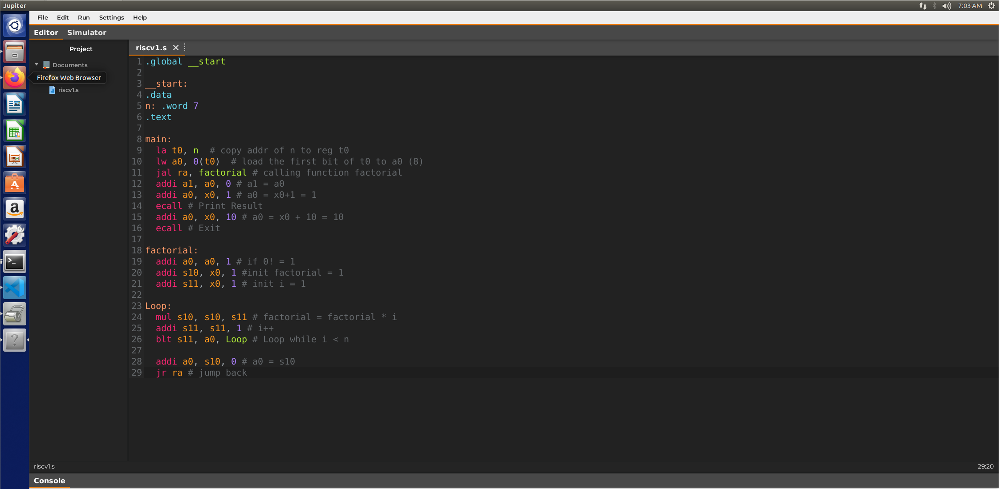
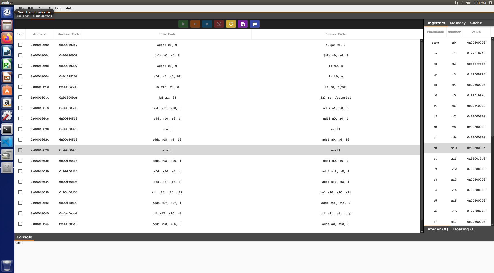

# EE341 Assignment 1

## Problems

> In this exercise you will be implementing a function factorial in RISC-V that has a single integer parameter n and returns n!
>
> A stub of this function can be found bellow. You will only need to add instrutions under the factorial, and the argument that is passed into the function is configured to be located at the label n.
>
> You may solve this problem using either recursion or iteration.
>
> As a sanity check, you should make sure your function properly returns that
>
> 3! = 6, 7!= 5040 and 8! = 40320.

## Code

We devide the code into three parts:

- ```main``` part: which is used to assign the proper value to the register.
- ```factorial``` part: which is used to specify the special case, like 0! = 1.
- ```Loop``` part: which is corresponding to the ```for loop``` part in the c code.

```assembly
.data
n: .word 7 # specify the input of the factorial number
.text

main:
la t0, n  # copy addr of n to reg t0
lw a0, 0(t0)  # load the first bit of t0 to a0 (8)
jal ra, factorial # calling function factorial
addi a1, a0, 0 # a1 = a0
addi a0, x0, 1 # a0 = x0+1 = 1
ecall # Print Result
addi a0, x0, 10 # a0 = x0 + 10 = 10
ecall # Exit

factorial:
addi a0, a0, 1 # if 0! = 1
addi s10, x0, 1 #init factorial = 1
addi s11, x0, 1 # init i = 1

Loop:
mul s10, s10, s11 # factorial = factorial * i
addi s11, s11, 1 # i++
blt s11, a0, Loop # Loop while i < n

addi a0, s10, 0 # a0 = s10
jr ra # jump back
```

## Venus simulation result



Calculating the factorial of 2.



Calculating the factorial of 7.



Calculating the factorial of 8.

Via [venus](https://www.kvakil.me/venus/)

## Linux VM Simulation Result

Via [https://github.com/andrescv/Jupiter](https://github.com/andrescv/Jupiter)





The simulation of 7!=5040.
